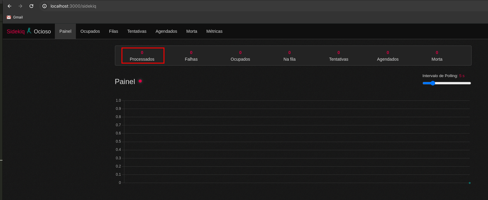
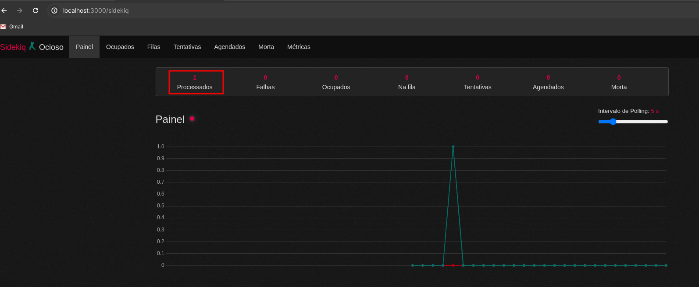

# Mailbox Manager

## Descrição
Esta aplicação é uma API backend desenvolvida em Ruby on Rails que gerencia domínios e caixas de email. Utiliza Sidekiq para processamento de jobs assíncronos, Redis como backend para o Sidekiq, e utiliza Docker para facilitar a execução e distribuição da aplicação.

## Requisitos do Desafio

### Regras de Negócio
- A aplicação gerencia domínios e caixas de email.
- Cada domínio possui uma frequência de expiração de senha das caixas em dias (30, 60, 90, 180 dias).
- Cada caixa de email possui uma expiração de senha agendada, atualizada baseada na frequência do domínio.
- Senhas das caixas são armazenadas em formato de hash (SHA-512).
- Quando a data de expiração de uma caixa é atingida, sua senha é expirada e atualizada para um valor aleatório.
- As senhas das caixas não podem ser armazenadas como texto plano no banco de dados.


### Modelagem dos Dados
```ruby
# Domain Model
- name: String
- password_expiration_frequency: Integer

# Mailbox Model
- domain_id: Integer
- username: String
- password: String (hashed)
- scheduled_password_expiration: Date
```


## Requisitos da Aplicação
- Endpoint obrigatório para atualização de senha de caixa de email: `PUT/domains/:domain_id/mailboxes/:mailbox_id`
- Configuração de Cron Job para processar a cada 2 minutos a atualização de senhas expiradas.

## Tecnologias Utilizadas
- Ruby 3.2.3
- Rails 7.0.8
- PostgreSQL
- Sidekiq
- Redis
- Cron Job (configurado com a gem Whenever)

## Configuração e Execução
### Pré-requisitos
- Docker instalado na máquina local

### Passos para Execução
1. Clone o repositório:
   ```bash
   git clone https://github.com/weslley6216/mailbox-manager.git
   cd mailbox-manager
   ```
2. Construa e inicie os containers Docker:
  ```bash
  docker-compose up --build
  ```
3. Acesse a aplicação em `http://localhost:3000`


## Testando Atualização Agendada de Expiração de Senhas
Para verificar que a atualização agendada de expiração de senhas está funcionando corretamente, siga os passos abaixo:

1. Após rodar o comando `docker compose up` acesse o container da aplicação:
  ```bash
  docker-compose run app bash
  ```
2. Dentro do bash do container, abra o console do rails:
  ```bash
  rails c
  ```
3. Verifique as datas agendadas no passado, devem retornar 4 registros no dia de ontem como definido no arquivo de db/seed:
  ```bash
  Mailbox.pluck(:scheduled_password_expiration).map { |date| date.strftime("%d/%m/%Y") }
  ```
4. Acesse o seguinte endpoint no seu navegador: [http://localhost:3000/sidekiq](http://localhost:3000/sidekiq), o número de jobs processados deve ser 0, como na imagem abaixo:

  

5. Após 3 minutos atualize a página do endpoint do [Sidekiq](http://localhost:3000/sidekiq) e veja agora que o número de jobs processados agora é 1, como na imagem abaixo:

  

6. Retorne ao rails console e execute novamente o comando para verificar as novas datas de expiração agendadas:
  ```bash
  Mailbox.pluck(:scheduled_password_expiration).map { |date| date.strftime("%d/%m/%Y") }
  ```
Retornará no console quatro datas agendadas, cada uma com 30, 60, 90 e 120 dias após a data original de agendamento.
